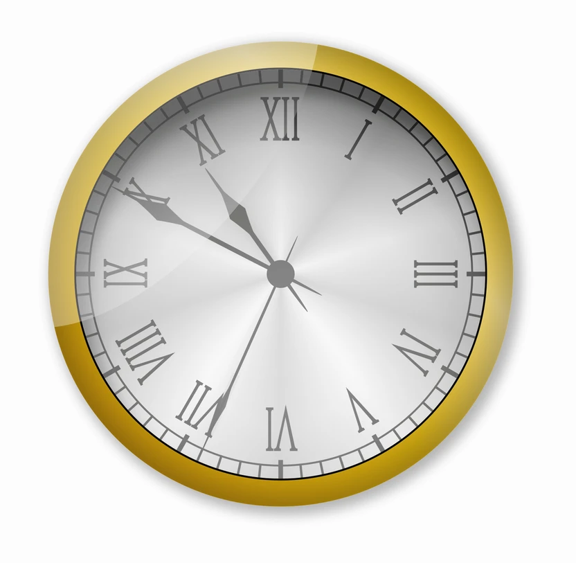

# 🕰️ Pocket Watch - 懐中時計

HTML・CSS・JavaScript を使って作成したアナログ時計（懐中時計）です。  
時針・分針・秒針にアニメーションが付き、金属フレームと文字盤をコーディングで再現しました。

## 🔍 Live Demo on CodePen

📎 [https://codepen.io/Naoki-Takeshita/pen/RNPdJjw](https://codepen.io/Naoki-Takeshita/pen/RNPdJjw)

---

